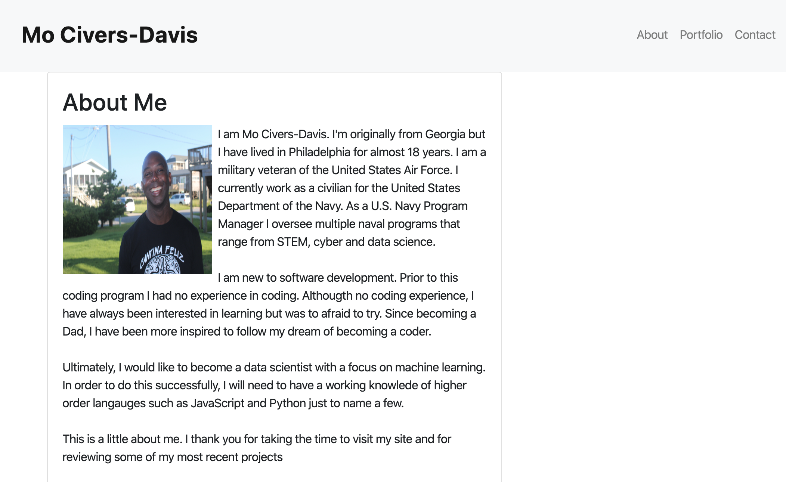

# Mo Civers-Davis Portfolio

## Description
The motivation for creating this project is two-fold.  Initially, this project provided an opportunity to display my coding skills while they continued to evolve.  As my skillsets developed I realized that not only is this an opportunity to display my skills but it is also an opportunity to better network within the tech industry.  

I am a newbie to an ever expanding industry that changes at what seems like the speed of light as new technologies and higher level langauages are introduced.  This project afords a unique  opportunity for me to present work that I've done, collaborate with others within the community of interest, and ultimately network up within the industry.  

Prior to this project, I had no respectful portfolio to present or the coding skills to develop any code to present.  Since starting the project I have learned Unix commands, HTML, CSS, Bootstrap, VS Code, Slack, Git Hub, GitLab, and Stack Overflow. We are now beginning to learn JavaScript.

As you review this project you will learn a little about me, my journey on the path to becoming a software devloper and some of my code from previous work.  You will also have an opportunity to reach out to me on the contacts page. 

## Table of Content
About
Details about me
My contact Information
  - Linkedin
  - GitHub Profile
  - Resume
  - Google Voice Phone Number
Portfolio
  - Stats On The Fly App 
  - Password Generator App
  - Weather Dashboard App
Contact
  - Free-form text outreach to me
  
